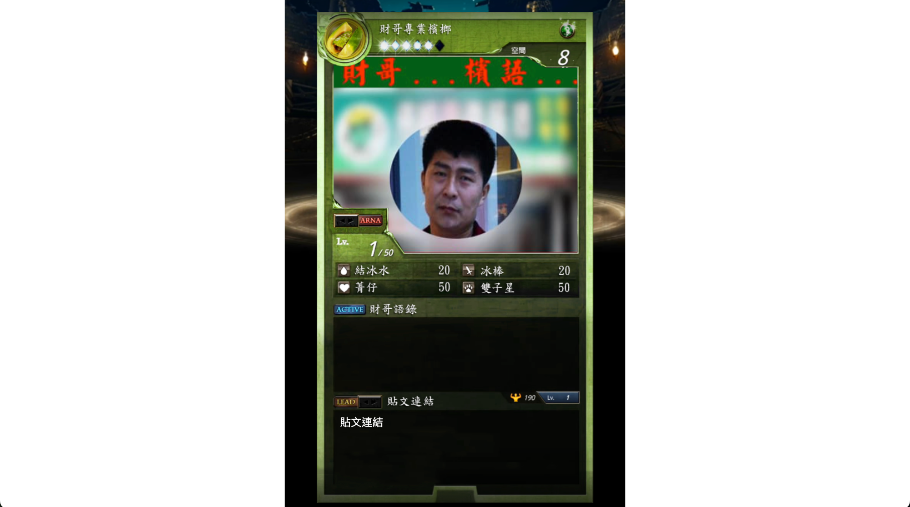
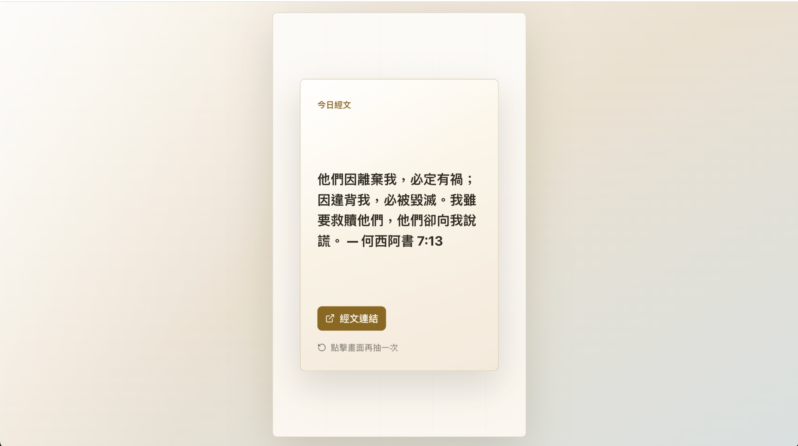

最近知道 codex 有發布 `/goal` 的功能，看[官方介紹](https://developers.openai.com/codex/use-cases/follow-goals)是可以做比較長的任務，跟我之前玩過的 ralph-loop 是同一個概念：**強制 AI 沒有完成任務就不能停下來**。

我用 codex 的情境幾乎都是請他幫我做 code review，我覺得他抓 bug 很厲害，但是開發體驗上我還是習慣用 claude code。

這次用 codex `/goal` 實驗把我以前做的抽卡小遊戲重構成 React 架構，實際不到十分鐘就完整改寫成 React 了。如果我自己來做的話，可能幾個小時過去了我還在調整樣式...

實際用下來還滿驚喜的，尤其 GPT-5.5 不會像 Opus 4.7 那樣有很多廢話，每一步要我確認的事情都是必須要做的，跟我傳達的資訊也不會有太多雜訊，未來我會想繼續用 Codex，還想用 `/goal` 這個功能去翻新我以前做的東西。

> 過去一年多以來一直有這種感覺：在沒有 AI 之前，明明知道結果會長什麼樣，我卻還要被自己的工作速度卡住；有了 AI 之後，只要講幾句話就能實現我想要的東西了。這次研究 `goal` 讓我覺得實現想要的東西又變得更輕鬆了。

## 核心概念

`/goal` 是 Codex CLI 的長時間任務模式，用來讓 Codex 朝一個 durable objective 持續工作，直到達成明確、可驗證的停止條件。

它不是單純要求 Codex 回答一次，也不是只產生計劃；比較像是把「目標、邊界、執行方式、驗證方式、停止條件」寫成一份工作合約，讓 Codex 可以跨多個 checkpoint 自主推進。

## Codex CLI 操作

啟用 experimental goal：

```text
/experimental
```

或在 `~/.codex/config.toml`：

```toml
[features]
goals = true
```

設定 goal：

```text
/goal <objective>
```

查看目前 goal：

```text
/goal
```

暫停、恢復、清除：

```text
/goal pause
/goal resume
/goal clear
```

## 什麼時候適合用

適合用 `/goal`：

- 任務比單一 prompt 大，但還不是開放式 backlog
- 有清楚完成條件，例如測試通過、migration parity 達成、部署成功、eval score 達標
- Codex 可以透過反覆修改、驗證、修正來推進
- 需要它長時間工作，不想每一步都手動指揮

不適合用 `/goal`：

- 需求還不清楚，只是想討論方向
- 只有一個簡單問題或一次性修改
- 是一串彼此無關的待辦事項
- 沒有可驗證的完成條件，只寫「做到最好」或「改善品質」

## `/goal` 和 `/plan` 的差異

`/plan` 是規劃模式：

```text
/plan 請先分析現況，提出實作計劃，不要修改程式碼。
```

適合還沒決定要不要做、想先審方案、或需要拆解任務時使用。

`/goal` 是執行模式：

```text
/goal 完成 X，直到 Y 驗證通過才停止。先讀 A，允許改 B，不要改 C，每個 checkpoint 跑 D。
```

適合已經決定要做，並且希望 Codex 持續推進到明確停止條件。

可以把 `/goal` prompt 理解成：

```text
Goal = Objective + Context + Scope + Execution + Validation + Stop condition
```

## 搭配 Markdown 作為參考資料

Markdown 的價值是管理複雜需求：

- 任務很長，需要多個 milestone
- 需要保留規格，之後重跑或交接
- 需要定義 UI、架構、測試策略
- 多人協作或需要 code review 前置文件

常見做法是把詳細規格寫在 `PLAN.md`，然後 goal 只負責引用：

```text
/goal Implement the work described in PLAN.md. Stop only when npm run lint and npm run test:e2e pass. Follow AGENTS.md, keep changes scoped, and report verification evidence.
```

簡單任務就不需要 Markdown，可以直接在 CLI 裡打一整段 `/goal ...`，只要目標、範圍、驗證和停止條件夠清楚即可。

## 寫 goal prompt 的重點

好的 goal prompt 應該回答這幾件事：

1. 要完成什麼單一目標？
2. 哪些資料必須先讀？
3. 允許改哪裡？不能改哪裡？
4. 每個階段要怎麼驗證？
5. 什麼狀態算完成？
6. 什麼情況應該暫停問人？

最重要的是停止條件要可驗證。比起「改善整體品質」，應該寫成「`npm run lint` 和 `npm run test:e2e` 都通過」、「eval suite 達到 90%」、「migration 後新舊輸出一致」、「部署 preview URL 可正常開啟」。

## 個人使用準則

- 還在想方向時，用 `/plan`。
- 已決定要做且有驗證條件時，用 `/goal`。
- 任務簡短時，直接把 goal 寫在 CLI。
- 任務複雜時，先寫 `PLAN.md`，再用 `/goal` 引用它。
- goal prompt 應該像合約，不像願望清單。

## 實際試一遍

[`css-card-game`](https://github.com/BolasLien/css-card-game) 是我 2020 年用 HTML + jQuery 寫的抽卡小遊戲。這次我用 `/goal` 把它重構成 React 19 + Vite 的版本（新 repo [`verse-draw`](https://github.com/BolasLien/verse-draw)），題材順手換成經文抽卡，但核心的抽卡互動跟 API 串接保留下來。

|        | 舊版 `css-card-game`                    | 新版 `verse-draw`                             |
| ------ | --------------------------------------- | --------------------------------------------- |
| 建立日 | 2020-05-19                              | 2026-05-13                                    |
| Stack  | HTML + jQuery + vanilla JS              | React 19 + Vite + Vitest + Playwright         |
| 結構   | `index.html` + `images/` + `js/` 純靜態 | 完整 React project（`src/` / `tests/` / e2e） |

舊版畫面：



新版畫面：



從下指令到本機跑起來、互動驗證完，整個過程不到 10 分鐘，後續換掉 API 跟樣式也沒花太多時間。

實際用的 `/goal` prompt：

```text
/goal 重做 css-card-game 為 React 版本，保留原本抽卡互動流程，直到本機 React app 可正常執行並完成互動驗證為止。

Objective:
- 將現有靜態 HTML/jQuery 抽卡小遊戲重做成 React app。
- 保留原本使用者流程：進入初始抽卡畫面，拖曳或滑動卡片觸發抽卡，播放抽卡/翻卡/放大動畫，從 API 取得資料並顯示描述與連結，點擊結果畫面可回到初始狀態。

Context:
- Read first: README.md, index.html。
- 目前專案是單頁靜態網頁，主要邏輯在 index.html，素材在 images/。
- 原本使用 jQuery UI draggable/droppable、jQuery Mobile vmouseout、axios。
- 新版本可以替換素材，但互動流程不可改變。
- 新版本優先使用 fetch，不保留 axios，除非有明確理由。

Scope:
- Allowed changes: 可新增 React 專案結構、更新 HTML/CSS/JS、調整或替換 images 素材、加入必要的 package scripts。
- Preserve: 抽卡流程、API 資料欄位使用方式、結果畫面顯示 description 與 link 的行為。
- Prefer: 現代 React 寫法、清楚的 component 切分、CSS 動畫或 transition、可在桌機與手機尺寸操作。
- 可以使用 Vite 建立 React app，除非 repo 已有其他更合適的前端工具鏈。

Non-goals:
- 不需要保留 jQuery、jQuery UI、jQuery Mobile 或 axios。
- 不需要完全 pixel-perfect 複製舊版視覺。
- 不需要新增後端。
- 不需要改 API。
- 不需要做登入、收藏、歷史紀錄、多語系等額外功能。

Execution:
- 先檢查 repo 規範與目前檔案結構。
- 先提出簡短 implementation plan，再開始修改。
- 建立或整理 React app 結構。
- 將抽卡狀態拆成清楚狀態，例如 idle、drawing、revealing、revealed。
- 用 pointer/touch/mouse 相容的方式實作拖曳或滑動觸發，不依賴 jQuery。
- 用 fetch 呼叫 API，處理 loading、成功與失敗狀態。
- 保持畫面第一眼就是可玩的抽卡介面，不做 landing page。
- 若替換素材，確保視覺仍明確表達「卡片/抽卡/揭曉結果」。
- 啟動本機 dev server，提供可試用 URL。

Validation:
- Run: npm install 或 pnpm install，依專案實際 package manager 決定。
- Run: npm run build。
- Run: npm run lint，如果有設定 lint script。
- 啟動 dev server，手動或用瀏覽器工具驗證：
  - 初始畫面可見。
  - 拖曳或滑動卡片會觸發抽卡。
  - 動畫流程會進入結果畫面。
  - API 回傳的 description 會顯示。
  - 貼文連結 href 會被設定。
  - 點擊結果畫面可回到初始狀態再抽一次。
  - 桌機與手機 viewport 都不應有明顯重疊或不可操作問題。

Pause conditions:
- Pause only if API 無法連線且無法判斷資料格式。
- Pause only if 需要刪除大量既有素材或做破壞性 git 操作。
- Pause only if package 安裝或瀏覽器驗證被環境權限阻擋。
- Pause only if 需要產品決策，例如是否完全改變抽卡主題、品牌或文案。

Stop condition:
- Stop when React 版本可在本機 dev server 執行，npm run build 通過，互動流程完成驗證。
- Final report must include changed files, validation commands and results, dev server URL, and remaining risks.
```

## 同場加映 codex-goal-writer Skill

為了讓 `/goal` 很好執行，我做了一個 [codex-goal-writer](https://github.com/BolasLien/skills/tree/main/skills/codex-goal-writer) Skill 可以快速產出結構化的 goal prompt。

以這次重構為例，我像下面這樣觸發 Skill，讓 Codex 幫我產生 goal prompt 後直接執行。

```
我想要重構做成 react 版本，不...應該說是重做，素材也可以換掉，但互動流程不變，axios 可能不需要留，用 fetch 應該就可以取得資料了。

我覺得這個任務可以轉成 goal
```

當使用者提到「幫我寫 /goal prompt」、「把這個任務轉成 goal」、「review 這個 goal prompt」時觸發這個 Skill，然後會產出包含 Objective / Context / Scope / Non-goals / Execution / Validation / Pause conditions / Stop condition 的結構化 prompt。
