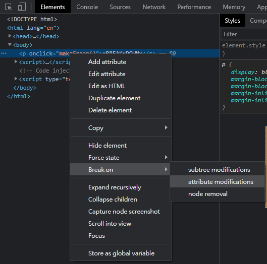
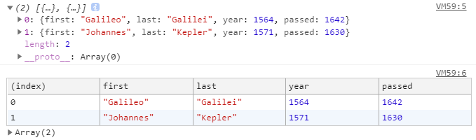

介紹一些開發時好用的方法，別再只會用`console.log`了


## Break on
在瀏覽器(chrome)的開發工具中，可以對`標籤`下斷點，當程式去改變標籤的時候，瀏覽器就會捕捉是誰改變的。


## 常見的印出訊息的方式。
* 直接印出來
* 插入字串
* 設定樣式

```javascript console.log
// 常見的用法
console.log('嗨!')

// 插入字串
// %s 是字串的變數
console.log('這是 %s ', '💩')

// 讓訊息可以有樣式
// %c後面的文字都會套用樣式
console.log('%c注意!', 'color:red; font-size:30px;')
console.log('謝謝你的%c注意!', 'color:red; font-size:20px;')
```

## 除了console.log，你還可以...
console.table()可以用表格的方式呈現物件內容

```javascript console.table
let a = [
  { first: 'Galileo', last: 'Galilei', year: 1564, passed: 1642 },
  { first: 'Johannes', last: 'Kepler', year: 1571, passed: 1630 },
]
console.log(a)
console.table(a)
```


## 帶有圖示的console
* `console.warn()`帶有警告圖示⚠️及樣式的訊息
* `console.error()`帶有錯誤圖示❌及樣式的訊息
* `console.info()`帶有資訊圖示ℹ️的訊息

```javascript console.warn console.error console.info
// 警告
console.warn('請注意腳下!')

// 錯誤
console.error('Shit! 踩到💩了!')

// 資訊
console.info('💩 這是一坨像冰淇淋🍦上的奶油一樣盤旋着的棕色大便')
```

## 測試
`console.assert()`如果帶入的值為`false`，就把訊息印出來

```javascript console.assert()
// false
console.assert(1===2,'1不可能等於2') // 1不可能等於2

// true
console.assert(1===1,'不可能錯啊')
```

## 清除console
`console.clear()`會把所有console都清掉，並且顯示`console was cleared`

```javascript console.clear
console.log('123')
console.log('456')
console.log('789')

console.clear() // console was cleared
```

## 看DOM的詳細內容
`console.dir()`可以把DOM當物件展開。
> MDN建議不要用在生產環境

```javascript console.dir()
<p>測試</p>

const p = document.querySelector('p')
console.log(p) // <p>測試<p>
console.dir(p) // p HTMLParagraphElement
```


## 把log群組起來
如果印出的訊息需要分類，可以用`console.group()`與`console.groupEnd()`來把`console.log()`包起來
> 預設是會把群組訊息展開，如果要預設收合起來，就要用`console.groupCollapsed()`

```javascript console.group
// console.group(群組名字)
console.group('馬鈴薯')
console.log('價格 18元');
console.log('重量 120g');
console.log('買5送1');
// console.groupEnd(群組名字)
console.groupEnd('馬鈴薯')
```

## 計算log出現的次數
`console.count()`可以印出訊息以及他出現的次數。

```javascript console.count
console.count('洋蔥') // 洋蔥: 1
console.count('馬鈴薯') // 馬鈴薯: 1
console.count('洋蔥') // 洋蔥: 2
console.count('洋蔥') // 洋蔥: 3
console.count('馬鈴薯') // 馬鈴薯: 2
console.count('馬鈴薯') // 馬鈴薯: 3
console.count('洋蔥') // 洋蔥: 4
console.count('洋蔥') // 洋蔥: 5
```

## 追蹤某個操作經過的時間
用`console.time()`開始計時，直到`console.timeEnd()`為止，會印出經過的操作耗費多少毫秒(每個人電腦不同，結果會不同)

```javascript console.time
console.time('for')
for(let i = 0; i<= 50; i++){
  console.log(i);
}
console.timeEnd('for') // for: 2.09423828125 ms
```

## 參考
[[javascript30] 09 - Dev Tools Domination](https://javascript30.com/)
[Console - Web APIs | MDN](https://developer.mozilla.org/zh-TW/docs/Web/API/Console)
