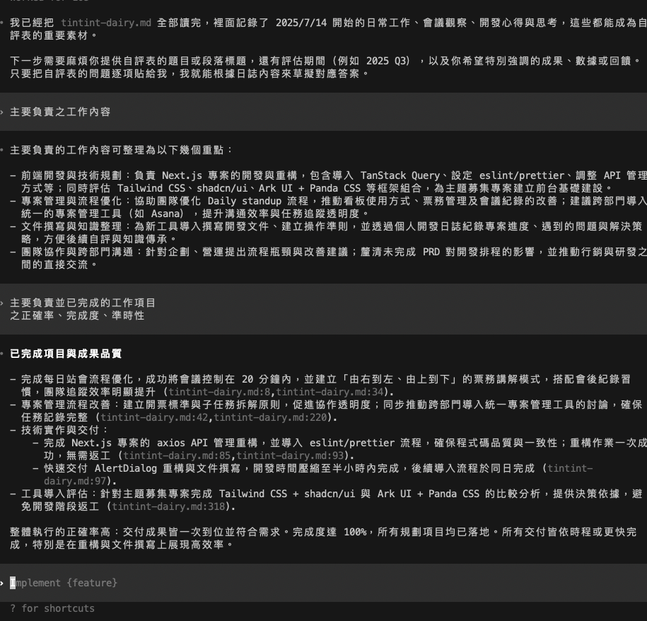

會開始研究 AI 寫作，是因為我在寫程式的時候可以做到讓 AI 穩定寫出開發規範的 Code，我認為既然可以做到「給規範生成 Code」，那我也能「給規範生成文字」。

於是我開始研究 AI 寫作，期望找到**跟 AI 協作寫部落格文章的工作流，讓 AI 產出真的像自己寫的**。

最近覺得 AI 寫作的研究算是告了一個段落，我覺得把這段歷程寫下來，或許未來再回頭看這些走過的路，也許也能有一點新的想法也說不定。

## 從寫績效考核帶給我的靈感

更久以前其實我是不敢用 ai 幫我寫東西，因為我覺得他寫得「不夠像我」，試過 ChatGPT 但是每次都讓我覺得還是不行，直到某次績效考核跟 gemini 商量「ai 寫得不夠像我」的煩惱後，他幫我建立 ai 的行為準則並且做成 `AGENTS.md`，我實驗用這個準則寫績效考核的自評表，結果出乎意料寫得很好。

當時使用 Codex 實驗 AI 寫績效考核，我的做法是提供我每天寫的工作日誌當作參考資料，他從我的日誌撈到我做過的事情並加以修飾，產出的大部分的內容都是可以直接用的，有很多工作上的細節是我幾乎忘記了，但他可以從日誌裡找到。

最驚喜的部分是，我寫日誌都很流水帳，他可以幫我整理成成果發表，他還知道哪些事情是指同一件事（不同天寫的筆記），還可以把我在日誌裡寫的廢話都略過，把我做過的事情整理成貢獻，下面是我當時的截圖：

(這個圖片還要再去識別化)

我想說既然可以寫績效考核，那應該也可以寫部落格文章，於是就開啟了我的 AI 寫作研究。

## 研究風格分析跟寫 Skill

我嘗試用 AI 寫部落格文章卻一直遇到一個困擾：寫出來的東西「不像我」。我猜想寫部落格文章是比較發散、比較個人化的寫作，而績效考核的內容則是比較局限、比較去個人化，這兩者的場景不同所以 AI 寫作的**命中率**也不一樣。

我一開始的假設是，在寫部落格文章的場景下，需要讓 AI 參考我寫過的文章才能讓他寫得「像我」，所以我給了好多筆記、段落，然後讓他幫我完成整個文章，但寫出來的東西都是 AI 味道、文章表達也不完全是我的觀點。

後來意識到只是給參考是不夠的，因為 AI 有這些特性：

- AI 很愛用「不是...而是...」、「今天要講的主題是...」、破折號等等的方式來表達。
- AI 不知道我的觀點是怎麼形成的，導致 AI 會自己腦補再完成文章。

> 有點像 AI 寫程式會遇到的問題，沒有給他限制的時候每次生成的程式碼 coding style 都不一樣、又會腦補不需要的功能。

後來找到[這篇文章](https://www.wilsonhuang.xyz/blog/ai-writing-system-personal-style-system-prompt)，也實驗文章中的做法：請 AI 幫我分析過去的文章，把幾個維度抓出來：口吻、寫作方式、用字習慣，另外再分析我的文章風格演進，抓出來現在的風格，最後我再做成我的寫作 skill。

我希望能做到，當我給 AI 一篇筆記的時候，他就會跟我討論我的觀點，然後透過我的回答累積文章素材，最後幫我整理成一篇文章，我用這種訪談的方式順利發布了這篇[我用 AI 寫程式這幾年](https://bolaslien.github.io/blog/2026/03/02/my-ai-coding-journey/)，也生成了一些部落格草稿（最後都棄用了）。

那時候有一種「AI 寫的東西越來越像我」的**幻覺**，現在再回頭看那時候寫的文章，我還是會覺得不像我寫的東西。

## 把 Skill 砍掉
